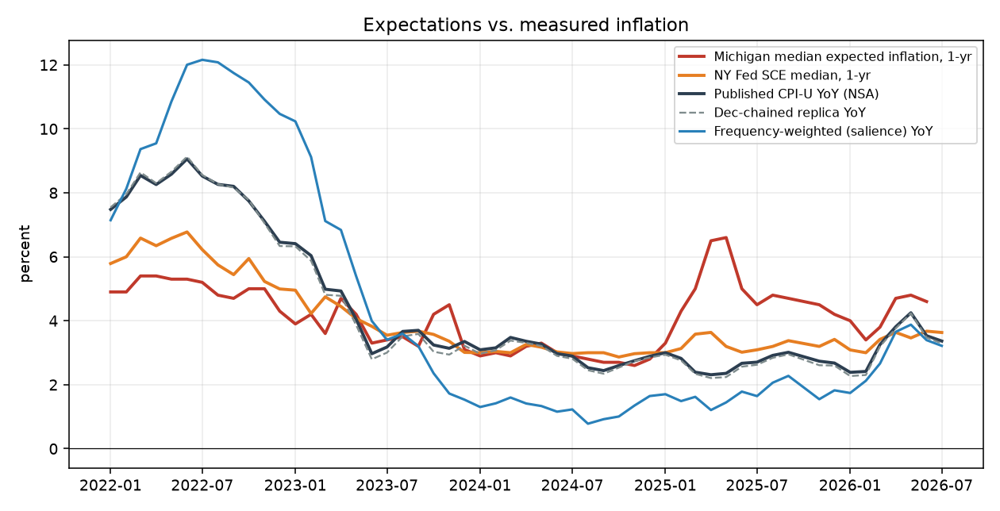
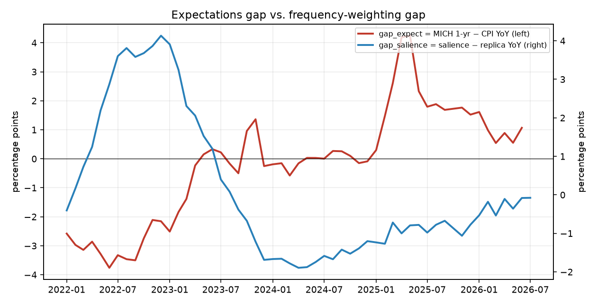
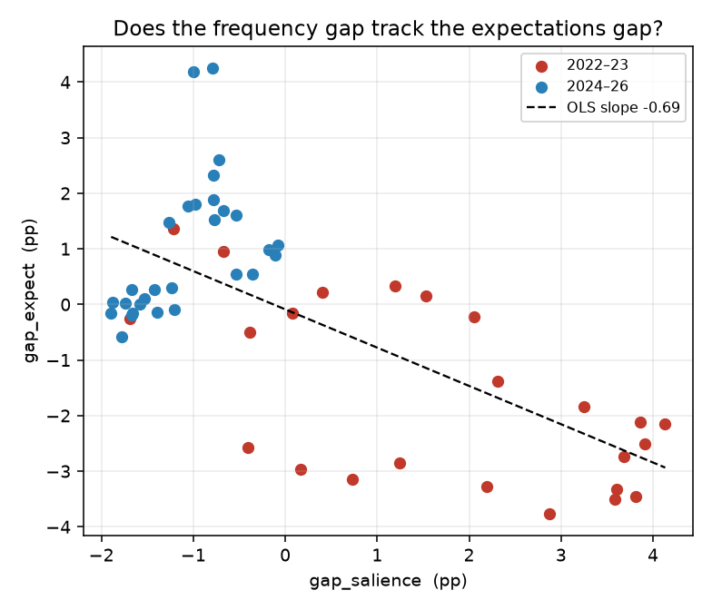
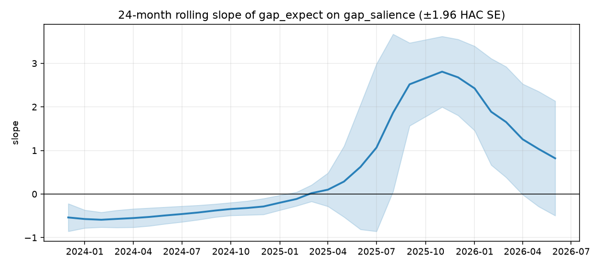
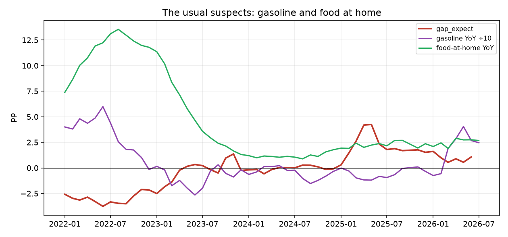

# R1 — Does the frequency-weighted CPI explain the household expectations gap?

**Tier 2 research note.** Sample 2022-01 … 2026-07 (54 months, 53 usable for Michigan).
Reproduce with `pipelines/r1_expectations.py`; machine-readable results in `$CPI_ROOT/out/r1_expectations.json`.

**Verdict up front: no. This is a nice chart, not a finding — and the sign runs the wrong way.**

---

## 1. Question

P1 builds a *frequency-weighted* ("salience") CPI: the same December-chained Laspeyres over the same
179-leaf universe as the official replica, but with each leaf weighted by how often households
*buy* it (weighted CE Diary purchase entries per consumer-unit-week) instead of how much they
*spend* on it. The folk hypothesis behind it is that households anchor on things they touch often —
groceries, gas — so a frequency-weighted index should sit closer to what they say about inflation
than the expenditure-weighted official index does.

That hypothesis is testable. Define

* `gap_expect` = Michigan median 1-year expected inflation − published CPI-U YoY (NSA)
* `gap_freq`   = frequency-weighted YoY − our official-replica YoY (`gap_salience` in the code)

If the salience story has content, `gap_freq` should move *with* `gap_expect`: when the
frequency-weighted index runs hot relative to official, households should be the ones running hot too.

## 2. Data

| Series | Source | Notes |
|---|---|---|
| Michigan median expected price change, next 1 yr | ISR data archive `mine.php`, Table 32 (POST, CSV) | cross-checked against FRED `MICH`: n=258, max abs diff **0.000**, corr **1.0000** |
| Michigan median, next 5 yrs | ISR Table 33 | |
| NY Fed SCE median 1-yr / 3-yr / 5-yr expected inflation | `FRBNY-SCE-Data.xlsx` | obtained without difficulty; sheets *Inflation expectations*, *Five-year ahead Infl Exp* |
| Published CPI-U NSA (`CPIAUCNS`) | FRED CSV (no key) | YoY computed calendar-aligned |
| `official_replica`, `salience`, `blend50` YoY | `p1_index` | re-queried at write-up time; no new schemes had landed yet |
| Gasoline (`SETB01`), food at home (`SAF11`) YoY | `cpi_item_month` | the two items the literature says drive perceptions |

Raw downloads are cached under `$CPI_ROOT/raw/expect/`.

**One month dropped.** `p1_index` reports a value for 2025-10, but only **11 of ~381** items have an
October-2025 observation (shutdown — gotcha #1). The index level for that month is computed off a
handful of leaves and is not comparable, so R1 drops it. This is a P1 bug, not an R1 choice; flagged
separately.

## 3. Method

OLS with Newey–West (HAC) standard errors, `maxlags = 12` to match the 12-month overlap induced by
using YoY rates at monthly frequency (results are essentially identical at `maxlags = 4`; see §4.5).
Subsamples 2022-01…2023-12 (n=24) and 2024-01…2026-07 (n=29). A 24-month rolling slope for stability.
No causal language is intended or warranted anywhere below.

## 4. Results

### 4.0 The picture (figures 1–3)

Annual averages, percent:

| year | CPI YoY | replica | **salience** | gap_freq | MICH 1y | MICH 5y | SCE 1y | SCE 3y | **gap_expect** | gas YoY | food-at-home YoY |
|---|---|---|---|---|---|---|---|---|---|---|---|
| 2022 | 8.01 | 8.03 | **10.49** | +2.46 | 5.02 | 2.97 | 5.97 | 3.36 | **−2.99** | +32.7 | +11.4 |
| 2023 | 4.14 | 3.98 | 4.88 | +0.90 | 3.82 | 2.98 | 3.92 | 2.86 | −0.32 | −9.4 | +5.1 |
| 2024 | 2.95 | 2.88 | **1.26** | −1.62 | 2.90 | 2.99 | 3.03 | 2.67 | −0.05 | −5.0 | +1.2 |
| 2025 | 2.69 | 2.61 | 1.69 | −0.91 | 4.85 | 3.69 | 3.26 | 3.02 | **+2.16** | −5.8 | +2.3 |
| 2026 (7m) | 3.29 | 3.22 | 2.95 | −0.27 | 4.22 | 3.42 | 3.42 | 3.13 | +0.94 | +18.0 | +2.5 |

Read the two bold columns against each other. In 2022 the frequency-weighted index ran **2.5 pp above**
official — and households' 1-year expectation sat **3.0 pp below** realized CPI. In 2025 the frequency
index ran **0.9 pp below** official — and households sat **2.2 pp above**. The two gaps are not
merely uncorrelated; over this window they are systematically *opposed*.

The scatter makes the mechanism obvious: the "relationship" is a two-regime split, not a within-regime
covariance. 2022–23 sits in the bottom-right (high `gap_freq`, negative `gap_expect`), 2024–26 in the
top-left.

### 4.1 Baseline: expectations gap on frequency gap

Dependent variable `gap_expect`, HAC(12) t-stats in parentheses.

| model | n | R² | adj R² | const | gap_freq | gas YoY | food-at-home YoY |
|---|---|---|---|---|---|---|---|
| (1) freq only | 53 | 0.453 | 0.442 | −0.089 (−0.19) | **−0.689 (−4.28)** | | |
| (2) gas + food | 53 | 0.699 | 0.687 | +1.340 (2.22) | | −0.024 (−2.70) | −0.301 (−5.00) |
| (3) horse race | 53 | 0.724 | 0.707 | +2.535 (6.30) | **+0.598 (2.42)** | −0.010 (−0.98) | −0.588 (−6.66) |
| (4) + official YoY | 53 | 0.799 | 0.791 | +3.455 (4.99) | +0.077 (**0.50**, p=0.62) | | |

Model (1): the univariate slope is **negative and strongly "significant"** (−0.69, t=−4.28, p<0.001,
R²=0.45). That is the *opposite* of the salience prediction. It is also not really about salience —
`gap_freq` is correlated 0.79 with the level of published CPI YoY, and `gap_expect` is
mechanically ≈ −CPI YoY (corr −0.89) because Michigan expectations barely move.

Model (4) is the decisive one. Regress `gap_expect` on published CPI YoY alone and you get R² = **0.797**.
Add `gap_freq` and R² goes to **0.799** — a ΔR² of **+0.0022**, HAC Wald χ²(1) = **0.25**, p = 0.62.
Once you know the official inflation rate, the frequency-weighting gap tells you **nothing** about the
expectations gap.

### 4.2 Horse race against the usual suspects

Gasoline and food-at-home YoY alone explain 70% of `gap_expect` (model 2). Adding `gap_freq`
(model 3) raises R² to 0.724 — ΔR² = **+0.025**, HAC Wald χ² = 5.84 (p ≈ 0.016), coefficient
**+0.598 (t = 2.42)**, and the sign has now flipped positive.

Do not believe that coefficient. `gap_freq` is correlated **+0.938** with food-at-home YoY. Adding it
roughly doubles the food coefficient (−0.301 → −0.588) while knocking gasoline from t=−2.70 to
t=−0.98. This is textbook collinear re-parameterisation of the food term, not new information; and
the +0.60 in model (3) contradicts the −0.69 in model (1) on the same 53 observations.

Incremental tests, all on the same panel:

| adding gap_freq to… | dep | R² restricted | R² full | ΔR² | HAC Wald χ²(1) |
|---|---|---|---|---|---|
| gas + food | `gap_expect` | 0.699 | 0.724 | +0.025 | 5.84 |
| **official CPI YoY** | `gap_expect` | **0.797** | **0.799** | **+0.002** | **0.25** |
| official + gas + food | `gap_expect` | 0.846 | 0.865 | +0.019 | 3.15 |
| gas + food | `gap_sce` | 0.863 | 0.878 | +0.016 | 6.48 |

### 4.3 Scale check — the index isn't big enough to matter

| | mean | sd | min | max |
|---|---|---|---|---|
| `gap_expect` (MICH − CPI) | −0.21 | 1.94 | −3.76 | +4.25 |
| `gap_sce` (SCE − CPI) | −0.35 | 1.06 | −2.76 | +1.32 |
| `gap_freq` (salience − replica) | **+0.17** | 1.88 | −1.89 | +4.13 |

Over 2022–26 there is essentially **no average level gap to explain**: Michigan 1-year expectations
averaged 4.14% against published CPI of 4.33%. The famous "households think inflation is higher than
the CPI" is a statement about *perceptions of past inflation*, which this window's expectations data
does not reproduce. And the frequency-weighted index averages only +0.17 pp above official — it moves
the level by a rounding error relative to the ±4 pp swings in `gap_expect`.

What the data actually shows is **anchoring**: sd(MICH 1-yr) = 0.98 vs sd(CPI YoY) = 2.17. Expectations
sit near 3–5% almost regardless of the print. `gap_expect` is then largely `−CPI YoY` by construction.

### 4.4 Does the salience index predict the *level* of expectations any better?

| dep = MICH 1-yr level | n | R² | slope |
|---|---|---|---|
| on official-replica YoY | 53 | 0.2137 | +0.204 (t=2.54) |
| on salience YoY | 53 | 0.2203 | +0.119 (t=2.53) |
| on both (replica + gap_freq) | 53 | 0.223 | +0.152 (1.22), +0.079 (0.53) |

A dead heat: 0.220 vs 0.214. Neither survives when entered jointly. Corr(MICH 1-yr, salience YoY) =
0.469 vs corr(MICH 1-yr, published CPI YoY) = 0.461. The salience index is better by 0.008 of a
correlation on 53 observations — which is to say, not better. This is the *strongest* form in which
the hypothesis can be stated from this data, and it is a tie.

### 4.5 Robustness

* **NY Fed SCE** (§3 sources; n=54) reproduces Michigan exactly. Univariate `gap_sce ~ gap_freq`:
  −0.417 (t=−5.26), R²=0.546 — wrong sign again. Horse race: gas+food alone R²=0.863; adding
  `gap_freq` gives +0.249 (t=2.55), R²=0.878, ΔR²=0.016. Same collinearity story
  (food coefficient −0.174 → −0.291).
* **Backward-looking specification** (`gap_expect_l12` = MICH 1-yr minus CPI YoY 12 months earlier):
  `gap_freq` coefficient −0.336, **t = −1.38, p = 0.17, R² = 0.061**. Nothing at all. The
  "households look backward" framing kills even the spurious univariate result.
* **`gap_expect_l1`** (vs. the print households had actually seen): −0.753 (t=−4.69), R²=0.522 —
  same artifact as the contemporaneous version.
* **Subsamples.** 2022–23 horse race: `gap_freq` +0.230, **t=1.39, p=0.17**. 2024–26 horse race:
  +0.156, **t=0.31, p=0.76**. The coefficient is insignificant in *both halves* despite being
  "significant" in the pooled sample — the pooled result is entirely a between-regime level shift.
  The univariate slope itself flips sign across halves: −0.538 (2022–23) vs +1.124 (2024–26).
* **Rolling 24-month slope** ranges from **−0.59 to +2.81** (fig 4). There is no stable parameter here.
* **HAC lag choice** is irrelevant: model (1) t = −4.28 at 12 lags, −4.80 at 4 lags; model (3)
  t = +2.42 vs +2.35.
* **blend50** behaves as a rescaled `gap_salience` (ratio ≈0.505, sd 0.023), as expected: −1.365 (t=−4.25)
  univariate, +1.177 (t=2.37) in the horse race, identical R² to three decimals.
* **Michigan 5-year** (`gap_expect5 ~ gap_freq`): −0.968 (t=−6.03), R²=0.602. Higher R² than the
  1-year version purely because 5-year expectations are *flatter still* (sd 0.37 vs 0.98), which makes the
  dependent variable an even purer copy of −CPI YoY. This is the artifact in its clearest form.

## 5. Limitations — read these before quoting any number above

1. **n ≈ 53.** Fifty-three monthly observations, of which the *effective* independent count is far
   smaller: every observation is a 12-month overlapping YoY rate, and both sides are highly
   persistent. HAC standard errors patch the inference but cannot manufacture information. A t of 2.4
   on 53 overlapping months is not evidence.
2. **One inflation cycle.** The sample is a single hump: the 2022 spike and its decay, plus a 2025–26
   re-acceleration. Any two smooth series over one cycle will correlate at |r| > 0.5. The
   "significant" pooled coefficients in §4.2 are regime dummies wearing a costume.
3. **Salience weights are nearly static.** P1 has CE Diary years 2022–24, so `gap_freq`'s time
   variation comes almost entirely from *item price movements*, not from changing purchase frequency.
   `gap_freq` is therefore close to a linear combination of food and gasoline inflation by
   construction (r = 0.938 with food-at-home). Regressing on it and on food simultaneously is close
   to regressing a variable on itself.
4. **Coverage asymmetry.** Items observed only in the CE Interview survey — rent, OER, vehicles,
   insurance, tuition, most medical — get *zero* salience weight by construction. Shelter alone is
   ~35% of official weight. So `gap_freq` is mostly "food and gas minus shelter", and any result is a
   statement about that, not about salience.
5. **Aggregate medians, not households.** Michigan/SCE published medians cannot identify whether the
   households whose baskets differ most from the CPI basket are the ones with the highest
   expectations. That is the actual test, and it needs microdata.
6. **October 2025** is missing from CPI entirely and was dropped; `p1_index`'s value for it is
   spurious (§2).

**What would be needed to do this properly:** (a) a purchase-frequency weight history going back to
at least the 1990s — multiple CE Diary vintages, so `gap_freq` varies from *weights* rather than only
from prices, and so the sample spans several inflation cycles; (b) household-level SCE or Michigan
microdata joined to household-specific CPI baskets (by income, tenure, region), so the test becomes
cross-sectional rather than 53 time-series points; (c) a perceptions series (past-year *perceived*
inflation) rather than expectations — the salience story is fundamentally about perception of
realized prices, and SCE's 1-year-ahead question is the wrong instrument for it.

## 6. Verdict

**Nice chart, not a finding — and to the extent the data says anything, it says the opposite of the
hypothesis.** The frequency-weighted CPI does not explain the gap between household inflation
expectations and official CPI over 2022–26. Conditional on the published inflation rate itself, it
adds ΔR² = 0.002 (χ² = 0.25, p = 0.62) to explaining the Michigan gap; the eye-catching univariate
slope is negative (−0.69, t = −4.28), i.e. the salience index ran *hottest* in 2022 exactly when
households were most *under*-predicting inflation, and coldest in 2024–25 exactly when they were most
over-predicting it. The apparently supportive +0.60 coefficient that appears once gasoline and food
are controlled for is a collinear restatement of the food-at-home term (r = 0.938), is insignificant
in both halves of the sample (p = 0.17 and p = 0.76), and its rolling estimate wanders from −0.6 to
+2.8. The real pattern in this window is much duller and much more robust: expectations are *anchored*
(sd 0.98 vs 2.17 for CPI), so the "expectations gap" is close to minus the inflation rate, and
gasoline plus food-at-home alone explain 70% of it. The frequency-weighted index remains a legitimate
and interesting descriptive statistic — it is just not the bridge to household perceptions, and this
note should not be cited as evidence that it is.
